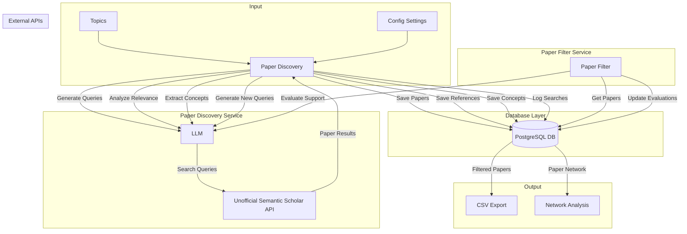
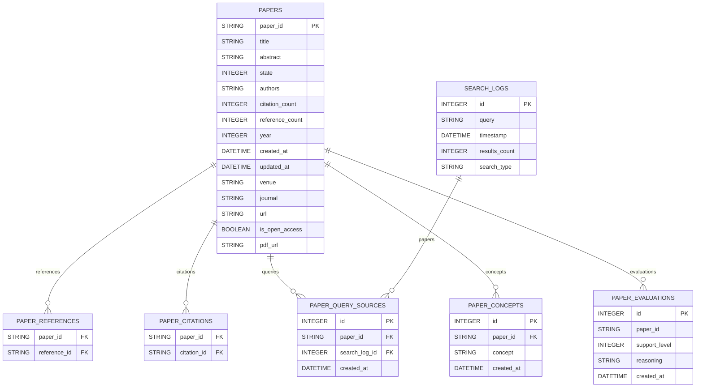

# Open Deep Paper Research

An AI-powered research assistant that performs iterative, deep research on any topic by combining search engines, web scraping, and large language models.

The goal of this repo is to provide a minimal and robust implementation of a deep research agent – one that refines its research direction over time while deep diving into topics. The repository builds on the unofficial Semantic Scholar API (https://github.com/danielnsilva/semanticscholar) to enhance academic discovery.

If you like this project, please consider starring it and following for updates.

## How It Works

## Database Schema



### Key Tables
- **Paper**: Stores paper metadata and content
- **SearchLog**: Records search queries and their metadata
- **PaperQuerySource**: Links papers to their search origins
- **PaperEvaluation**: Stores AI evaluations of papers
- **PaperConcept**: Maps papers to their key concepts

### Key Relationships
- Papers can reference or cite other papers (many-to-many)
- Each paper can be found through multiple searches
- Papers can have multiple evaluations and concepts
- Search logs track which papers were found in each query

## Features

- **Iterative Research**: Iteratively builds on search results to refine and dive deeper into topics.
- **Intelligent Query Generation**: Uses LLM models to generate contextual, targeted queries.
- **Depth & Breadth Control**: Configurable control parameters to tune research breadth and depth.
- **Smart Follow-ups**: Automatically generates follow-up queries from previous results.
- **Comprehensive Markdown Reports**: Produces detailed reports with findings and sources.
- **Parallel Processing**: Supports concurrent processing for efficiency.

## Requirements

- Python 3.8+
- API keys for:
  - Unofficial Semantic Scholar API (see https://github.com/danielnsilva/semanticscholar)
  - OPENAI API (for LLM models)

## Setup

1. Clone the repository:
   ```bash
   git clone https://github.com/harveylijh/deep-paper-research.git
   cd deep-paper-research
   ```

2. Install dependencies:
   ```bash
   pip install -r requirements.txt
   ```

3. Configure environment variables in a `.env` file:
   ```bash
   OPENAI_API_KEY="your_open_ai_key"
   DATABASE_URL="your_postgres_db_url"
   ```

## Usage

1. Initialize the database:
   ```bash
   python scripts/db.py init
   python scripts/db.py migrate "/+ year for paper"
   python scripts/db.py upgrade
   ```

2. Run the discovery process:
   ```bash
   # Test connection only
   python scripts/run.py --check-only

   # Run with default settings
   python scripts/run.py

   # Run with custom parameters
   python scripts/run.py --max-papers 100 --max-depth 3 --topics-file custom_topics.json
   python scripts/run.py --filter-papers --support-threshold 6.0
   ```

3. Reset the database:
   ```bash
   python scripts/manage_db.py reset
   ```

## Roadmap
1. Automated literature review generation with:
   - Executive summary
   - Key findings synthesis
   - Research gaps identification
   - Future directions suggestions
2. Auto TL;DR generation for papers with:
   - Key takeaways
   - Methodology overview
   - Main contributions
   - Critical analysis
3. Compatible for LLM other than OpenAI
4. Support local DeepSeek model
5. Reflection while fetching instead of a separate action
6. Citation graph visualization and analysis
7. Export results in various formats (BibTeX, CSV, JSON)
8. Integration with reference management tools (Zotero, Mendeley)
9. Custom filtering by impact factor and citation count
10. Author network analysis and collaboration recommendations
11. Research trend analysis and prediction

## Contributing

Feel free to fork the repository and submit pull requests. Please adhere to the code style and add tests where applicable.

## License

MIT License
